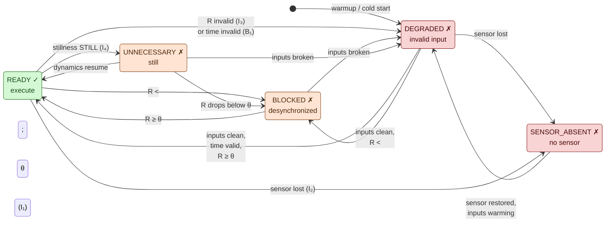
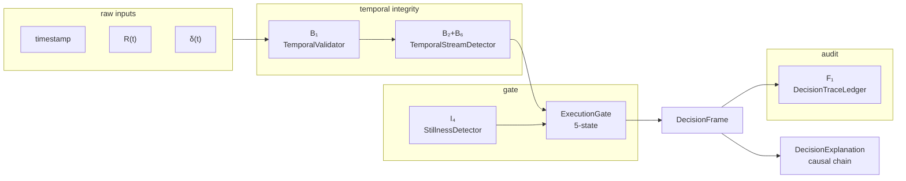

# Gate state machine — visual

*GitHub renders the Mermaid block below natively. This document is
the visual complement to [`STATE_MACHINE.yaml`](../../STATE_MACHINE.yaml)
(the machine-readable spec) and
[`invariant_matrix.md`](invariant_matrix.md)
(the cross-product safety proof).*

---

## 1. Five states, one permissive



## 2. The strict priority order inside `ExecutionGate.evaluate`

```mermaid
flowchart TD
    input((input tick)) --> B1{time_quality<br/>VALID?}
    B1 -- "no · B₁" --> DEG[DEGRADED]
    B1 -- "yes" --> I2{sensor<br/>present?}
    I2 -- "no · I₂" --> SA[SENSOR_ABSENT]
    I2 -- "yes" --> I3{R valid &<br/>in [0, 1]?}
    I3 -- "no · I₃" --> DEG
    I3 -- "yes" --> I1{R ≥ θ?}
    I1 -- "no · I₁" --> BLK[BLOCKED]
    I1 -- "yes" --> STL{stillness<br/>layer attached<br/>and δ valid?}
    STL -- "no" --> RDY[READY]
    STL -- "yes" --> DET{detector<br/>says STILL?}
    DET -- "no · ACTIVE" --> RDY
    DET -- "yes · I₄" --> UNN[UNNECESSARY]

    classDef permissive fill:#d4f8d4,stroke:#2a7a2a,color:#1a4d1a
    classDef blocking fill:#ffe4d4,stroke:#8a4a1a,color:#4d2a0a
    classDef fault fill:#f8d4d4,stroke:#8a1a1a,color:#4d0a0a

    class RDY permissive
    class BLK blocking
    class UNN blocking
    class SA fault
    class DEG fault
```

## 3. Layered pipeline composition



---

## 4. Legend

| Colour | Meaning |
|---|---|
| 🟢 green | Permissive — `execution_allowed = True`. Only `READY`. |
| 🟠 orange | Blocking but benign — upstream input is valid, system is self-reporting a non-actionable regime. `BLOCKED` (desync) or `UNNECESSARY` (still). |
| 🔴 red | Fault — something upstream cannot be trusted. `SENSOR_ABSENT` (hardware) or `DEGRADED` (input/time invalid). |

## 5. Load-bearing properties (enforced by CI)

* **Only `READY` is permissive.** Enforced at construction
  (`GateDecision.__post_init__`) and proven by the A3 cross-module
  invariant matrix ([HN16](../../INVARIANTS.yaml)).
* **Priority order is strict.** `B₁ > I₂ > I₃ > I₁ > I₄`.
  Proven by 8 priority-ordering tests in
  [`tests/test_invariant_matrix.py`](../../tests/test_invariant_matrix.py).
* **Every state is reachable.** Both point-wise (A3 cross-product)
  and through a natural `StreamingPipeline` tick sequence.
* **Every transition is test-bound.** `STATE_MACHINE.yaml` × A1 CI
  meta-test enforces that every transition declared in the spec
  has at least one passing pytest node.

See [`invariant_matrix.md`](invariant_matrix.md) for the full
safety × liveness proof.
